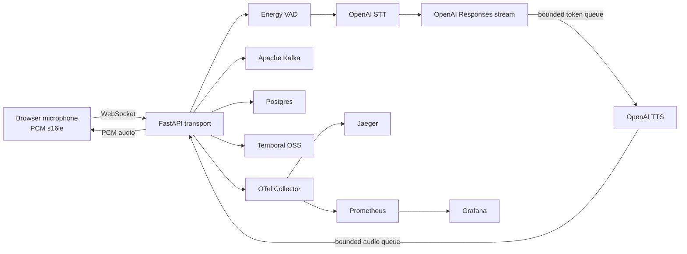
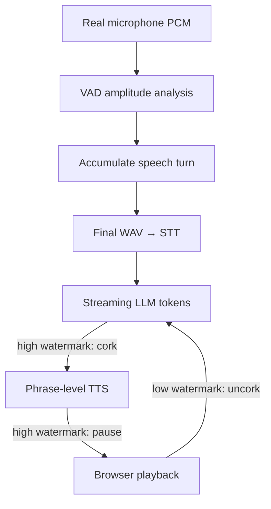

# VoiceMesh

VoiceMesh is a Vapi-inspired reliability lab for a real-time voice AI pipeline. It is
based on public voice-infrastructure challenges and role requirements. It does **not**
claim to reproduce or describe Vapi's internal architecture.

The project demonstrates how a backend team can reason about latency, provider
pluggability, backpressure, event streaming, durable recovery, duplicate delivery,
and database failure modes in a live voice agent system. The default path is real:
browser microphone input, OpenAI STT, streaming OpenAI LLM output, OpenAI TTS, and
browser audio playback.

## What It Demonstrates

- Real `VAD → STT → LLM → TTS → Transport` execution
- Bounded queues with cork/uncork backpressure
- Provider interfaces that isolate core pipeline logic
- Apache Kafka event streaming and replay visibility
- Temporal OSS durable call/session lifecycle
- Postgres idempotency keys and transactional outbox
- OpenTelemetry spans exported through a local Collector to Jaeger
- Prometheus metrics and a provisioned Grafana dashboard
- Duplicate event rejection without duplicate state transitions
- Provider latency, failure, timeout, DB-write, and worker-crash injection
- A Next.js operator dashboard with browser microphone and PCM playback

## Architecture





## Kafka vs. Temporal

Kafka carries high-volume pipeline, provider, and call events. Temporal owns the
long-running call lifecycle and durable state machine. Raw audio does not enter
Temporal, and individual LLM tokens do not enter Temporal. High-level signals such as
`call.started`, `pipeline.corked`, `provider.failed`, and `call.completed` do.

See [docs/kafka_vs_temporal.md](docs/kafka_vs_temporal.md).

## Quick Start

Requirements:

- Docker Desktop with Compose v2
- Python 3.11+ for local tests and scripts
- Node.js 20+ for local dashboard development
- A real OpenAI API key

```bash
cp .env.example .env
# Edit .env and set OPENAI_API_KEY.
make up
```

Open:

- Dashboard: [http://localhost:3000/demo](http://localhost:3000/demo)
- FastAPI: [http://localhost:8000/docs](http://localhost:8000/docs)
- Temporal UI: [http://localhost:8080](http://localhost:8080)
- Kafka UI: [http://localhost:8081](http://localhost:8081)
- Jaeger: [http://localhost:16686](http://localhost:16686)
- Grafana: [http://localhost:3001](http://localhost:3001), admin/admin

The API fails fast if an OpenAI provider is selected without `OPENAI_API_KEY`.
There is no silent fake-provider fallback.

## Browser Call

1. Run `make up`.
2. Open `http://localhost:3000/demo`.
3. Select **Start microphone** and allow microphone access.
4. Speak, then pause for roughly 700 ms.
5. Watch VAD close the turn, STT finalize the transcript, LLM tokens stream, TTS
   audio arrive, and the browser play 24 kHz PCM.
6. Search the call's trace in Jaeger by the `voicemesh-api` service.

The browser sends real signed 16-bit PCM chunks. The first VAD implementation measures
RMS energy from those samples; it is not timer-based. The VAD interface is designed for
a future WebRTC VAD or Silero implementation.

## Reliability Demos

```bash
make demo-normal-call
make demo-tts-backpressure
make demo-duplicate-events
make demo-db-down
make demo-kill-worker
```

### TTS Backpressure

`make demo-tts-backpressure` requires no microphone. It uses OpenAI TTS to create a
spoken test prompt, streams that PCM through the normal WebSocket path, and injects
400 ms of delay per TTS output chunk. LLM tokens enter the bounded queue until the
high watermark is reached and the pipeline emits `pipeline.corked`. Four seconds
later the script removes the delay, verifies `pipeline.uncorked`, and prints links to
the persisted call timeline and Jaeger trace.

### Duplicate Event Replay

`make demo-duplicate-events` replays the latest persisted event with its original
idempotency key. The unique key prevents a second state transition, and VoiceMesh
publishes `duplicate_event.ignored`.

### Postgres Down

`make demo-db-down` pauses Postgres for 15 seconds. Kafka and the in-memory live audio
path remain available. DB operations use bounded exponential retry and surface
failures. After Postgres resumes, new writes and the outbox poller recover. Writes that
exhausted all retries are not reconstructed automatically in this POC.

### Temporal Worker Crash

`make demo-kill-worker` stops only the Temporal worker, leaves the server and workflow
history intact, then restarts the worker. Pending workflow tasks continue from durable
history. Inspect `call-<call_id>` in Temporal UI.

## Provider Abstraction

Core pipeline code depends on `STTProvider`, `LLMProvider`, and `TTSProvider`
interfaces. The registry owns concrete construction from environment configuration.
OpenAI is the implemented default. Local Whisper, Ollama, and Piper adapters can be
added to the registry without changing `StreamModule`.

See [docs/provider_abstractions.md](docs/provider_abstractions.md).

## Postgres Reliability

Critical event persistence inserts the idempotency key, call event, and outbox record
in one transaction. The background outbox publisher uses `FOR UPDATE SKIP LOCKED`,
publishes with Kafka's idempotent producer, and records attempts/errors. Non-critical
metric failures degrade without terminating the live call.

See [docs/postgres_reliability.md](docs/postgres_reliability.md).

## Observability

VoiceMesh instruments FastAPI, WebSocket receive/send, VAD, providers, queues, Kafka,
Postgres, and Temporal activities. Trace attributes include call, turn, provider,
stage, event type, queue depth, idempotency key, and latency where applicable.

Prometheus metrics include stage latency, queue depth, cork transitions and duration,
duplicates, provider failures, DB write failures, and active calls.

See [docs/otel_tracing.md](docs/otel_tracing.md).

## Commands

| Command | Purpose |
|---|---|
| `make up` | Build and start the complete local stack |
| `make down` | Stop the stack |
| `make restart` | Restart services |
| `make logs` | Follow service logs |
| `make api` | Run FastAPI locally |
| `make worker` | Run the Temporal worker locally |
| `make dashboard` | Run Next.js locally |
| `make migrate` | Reapply the idempotent SQL migration |
| `make create-topics` | Create required Kafka topics |
| `make smoke-live-pipeline` | Run a real OpenAI STT → LLM → TTS WebSocket smoke test |
| `make test` | Run Python tests |
| `make lint` | Run Ruff, mypy, and dashboard lint |

`make smoke-live-pipeline` synthesizes a spoken prompt, sends its PCM through the same
WebSocket contract as the browser, and verifies the persisted call outcome. It uses
real OpenAI APIs and incurs normal API usage.

## Event Contract

Every Kafka event has:

```json
{
  "event_id": "uuid",
  "call_id": "string",
  "turn_id": "string",
  "event_type": "string",
  "stage": "string",
  "timestamp": "iso8601",
  "sequence_number": 1,
  "idempotency_key": "string",
  "payload": {},
  "trace_id": "string | null"
}
```

Topics are `call-events`, `pipeline-events`, `provider-events`, `outbox-events`, and
`dead-letter-events`.

## Screenshots

> Placeholder: live demo page with transcript, response, queue depth, and cork state.

> Placeholder: Jaeger trace spanning WebSocket, STT, LLM, TTS, Kafka, and Postgres.

> Placeholder: Temporal workflow history surviving a worker restart.

## Known Limitations

- The energy VAD is intentionally simple and environment-sensitive. Replace it with
  WebRTC VAD or Silero before production use.
- The browser uses `ScriptProcessorNode` for broad POC simplicity. An AudioWorklet is
  the production migration path.
- OpenAI STT is turn-finalized rather than partial streaming transcription.
- Partial transcript coalescing is therefore not implemented in this POC; the
  backpressure demo preserves and throttles LLM tokens and final text instead.
- Phrase-level TTS starts at punctuation or 120 characters; it is not semantic chunking.
- Only OpenAI providers are implemented. Local-provider extension points are real, but
  Whisper/Ollama/Piper adapters are future work.
- Provider fallback selection is durable in Temporal, but no second provider ships by
  default; a failure moves to `RECOVERY_REQUIRED` unless another provider config exists.
- Non-critical DB writes that exhaust retries while Postgres is unavailable are visible
  but are not automatically reconstructed. Critical pre-publish events use the outbox.
- This is a serious single-node POC, not a multi-region deployment, load test, or formal
  exactly-once system. Kafka and Postgres provide at-least-once building blocks plus
  idempotent effects.

## Future Work

- WebRTC VAD/Silero and an AudioWorklet capture path
- Local Whisper, Ollama, and Piper adapters
- Kafka consumer lag panels and dead-letter replay UI
- Durable buffering of DB-degraded non-critical writes
- Barge-in, cancellation, and full-duplex turn interruption
- Multi-worker load tests, chaos automation, and SLO burn-rate alerts

Deep architecture and demo guidance live in [docs/architecture.md](docs/architecture.md)
and [docs/demo_script.md](docs/demo_script.md).
