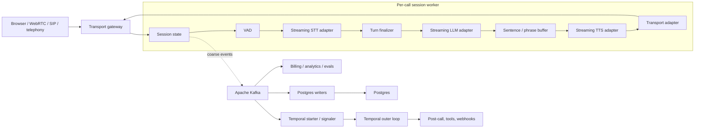

# VoiceMesh

VoiceMesh is a production-inspired reliability lab for real-time voice AI
infrastructure. It explores latency, provider abstraction, backpressure, event
streaming, durable workflow boundaries, billing, and observability in a local
end-to-end system.

The project provides a real local vertical slice: browser PCM input, VAD, OpenAI STT,
streaming OpenAI LLM output, OpenAI TTS, browser playback, Apache Kafka, Temporal OSS,
Postgres, OpenTelemetry, Jaeger, Prometheus, and Grafana.

## Capabilities

- Real `VAD → STT → LLM → TTS → Transport` execution with WebRTC VAD endpointing
- In-memory weighted queues with cork/uncork backpressure
- Provider adapters that isolate the session runtime from concrete APIs
- Kafka event streaming, replay, and duplicate-delivery experiments
- Temporal worker recovery for durable outer-loop work
- Postgres idempotency and transactional outbox mechanics
- Per-call provider usage metering and a finalized billing ledger
- OpenTelemetry traces and Prometheus metrics
- Provider latency/failure and database-outage injection
- A Next.js dashboard with browser microphone and PCM playback

## Architecture

The production-oriented design keeps the live media path in one per-call session
worker. Kafka, Postgres, and Temporal are adjacent systems, not handoff stages between
STT, LLM, and TTS.



The session worker owns the transport connection, active provider streams, call and
turn IDs, response-fenced text/audio queues, phrase buffering, cancellation, and
barge-in state. Kafka provides coarse durable events and fanout. Postgres is the system of
record. Temporal is optional for post-call and retry-heavy workflows; it is not part of
normal streaming or cork/uncork.

Read [docs/architecture.md](docs/architecture.md) for the full model,
[docs/runtime_boundaries.md](docs/runtime_boundaries.md) for turn fencing, cancellation,
and barge-in, and [docs/vad-and-endpointing.md](docs/vad-and-endpointing.md) for noisy
environment tuning. See [docs/backpressure.md](docs/backpressure.md) for the hot-path
flow-control model and [docs/barge-in.md](docs/barge-in.md) for candidate-confirmation
interruption handling.

## Current POC

The working implementation intentionally has several simpler boundaries:

- Browser WebSocket is the local transport adapter.
- Browser microphone capture requests echo cancellation, noise suppression, and automatic
  gain control where supported.
- VAD defaults to WebRTC VAD over normalized 16 kHz PCM, with an adaptive RMS/energy VAD
  fallback and an optional Silero extension point.
- Endpointing uses a smoothed `QUIET → STARTING → SPEAKING → STOPPING` state machine, so
  one noisy frame does not create a user turn.
- Short, sparse, or empty-transcript turns are suppressed before LLM/TTS and surfaced as
  `vad.noise_turn_ignored` observability events.
- A long-lived OpenAI Realtime transcription session receives 24 kHz PCM continuously,
  emits partial deltas, and is committed at the detected turn boundary.
- LLM and TTS stream through real bounded in-memory queues. `llm_to_tts` corks on
  queued speak-ahead milliseconds, and `tts_to_transport` corks on queued playable
  audio milliseconds.
- Kafka receives coarse stage, lifecycle, provider, and usage events; raw audio, LLM
  tokens, and TTS chunks remain in memory/WebSocket only.
- A Kafka consumer projects calls, events, metrics, idempotency keys, usage, and billing
  into Postgres outside the live provider chain.
- Billing uses measured STT audio duration, provider-reported LLM tokens, estimated TTS
  tokens, and a configurable per-minute platform fee.
- A Temporal workflow still starts per call for the recovery lab, but routine
  cork/uncork is no longer signaled to it.
- Barge-in uses a browser-side speculative candidate, backend VAD confirmation,
  response fencing, browser stale-audio rejection, and post-STT semantic resolution.
  Exact browser playback resume after a rejected candidate and provider-native request
  abort remain production hardening work.

These are documented current behaviors, not the recommended production architecture.
The next production-oriented step is tighter browser/provider cancellation and moving
Temporal entirely to lifecycle work that genuinely requires durable workflow semantics.

## Kafka, Postgres, And Temporal

Kafka is for fanout, replay, persistence consumers, billing, analytics, debug timelines,
and triggering durable work. It should not carry every audio frame, STT partial, LLM
token, or TTS chunk by default.

Postgres stores tenant and assistant configuration, call metadata, final transcripts,
summaries, tool/webhook state, billing records, idempotency keys, and outbox rows. It
should not block the transition from STT to LLM or LLM to TTS.

Temporal is justified for post-call finalization, webhook retries, billing
finalization, summary/evaluation pipelines, recording/transcript finalization, and
long-running or state-changing tools. A one-step idempotent Kafka consumer may be
simpler when durable workflow semantics are unnecessary.

See [docs/kafka_vs_temporal.md](docs/kafka_vs_temporal.md),
[docs/events.md](docs/events.md), and
[docs/postgres_reliability.md](docs/postgres_reliability.md).

## Billing

The session worker emits `usage.stt`, `usage.llm`, and `usage.tts` during the call and a
`usage.finalization_barrier` at call end. The event worker consumes Kafka in bounded
batches, writes immutable `usage_records`, stores per-turn usage expectations, advances
projection watermarks, applies the versioned `pricing_catalog`, and rolls costs into
`call_billing`. The final bill is:

`provider cost + configurable platform fee per call minute`

STT audio duration and LLM token counts are measured. TTS input/output tokens are
estimated from synthesized text and PCM duration because the current Speech API
response does not expose token usage; the dashboard labels those rows as estimated.

Open [http://localhost:3000/billing](http://localhost:3000/billing) for totals,
per-model usage, and the per-call ledger. Pricing is a dated local snapshot for this
lab, not an invoice from OpenAI. See [docs/billing.md](docs/billing.md).

## Provider Adapters

The target contracts are `STTProvider`, `LLMProvider`, `TTSProvider`,
`TransportProvider`, and optionally `ToolExecutor`. Adapters normalize stream
lifecycle, partial/final transcripts, token deltas, tool calls, latency milestones,
cancellation, errors, and provider metadata.

OpenAI is the implemented default. The registry fails fast without
`OPENAI_API_KEY`; there is no silent fake-provider fallback. See
[docs/provider_abstractions.md](docs/provider_abstractions.md).

## Quick Start

Requirements:

- Docker Desktop with Compose v2
- Python 3.11+ for local tests and scripts
- Node.js 20+ for local dashboard development
- A real OpenAI API key

```bash
cp .env.example .env
# Edit .env and set OPENAI_API_KEY.
make up
```

Open:

- Dashboard: [http://localhost:3000/demo](http://localhost:3000/demo)
- Billing: [http://localhost:3000/billing](http://localhost:3000/billing)
- FastAPI: [http://localhost:8000/docs](http://localhost:8000/docs)
- Temporal UI: [http://localhost:8080](http://localhost:8080)
- Kafka UI: [http://localhost:8081](http://localhost:8081)
- Jaeger: [http://localhost:16686](http://localhost:16686)
- Grafana: [http://localhost:3001](http://localhost:3001), `admin/admin`

## Browser Call

1. Run `make up`.
2. Open `http://localhost:3000/demo`.
3. Select **Start microphone** and allow microphone access.
4. Speak, then pause for roughly 700 ms. In noisy spaces, watch the browser mic controls
   and VAD debug cards to confirm the active provider, state, energy, and noise-floor
   behavior.
5. Watch partial STT text arrive while PCM is still streaming, then the final turn,
   LLM tokens, TTS audio, and browser playback.
6. Open Jaeger, select `voicemesh-api`, filter operation `voice.call`, or paste the
   trace ID shown on the call detail page.

The browser sends signed 16-bit PCM chunks. Browser constraints are a best-effort first
defense; the backend still normalizes audio for WebRTC VAD and applies smoothed
endpointing plus STT guardrails before the LLM sees a turn.

## Reliability Scenarios

```bash
make demo-normal-call
make demo-tts-backpressure
make demo-duplicate-events
make demo-db-down
make demo-kill-worker
make demo-durable-action-cancel
make demo-billing-late-tts
make demo-noise-vad
```

### TTS Backpressure

`make demo-tts-backpressure` requires no microphone. It creates spoken test input with
OpenAI, sends it through the normal WebSocket path, and injects 400 ms delay per TTS
output chunk. The `llm_to_tts` queue accumulates estimated future speech duration
(`queued_speak_ahead_ms`). At the high watermark the session worker corks upstream LLM
phrase production. After the delay is removed, TTS catches up, the speak-ahead budget
drains to the low watermark, and the session worker uncorks.

The transport side uses the same pattern with playable audio duration:
`tts_to_transport` tracks `queued_audio_ms` instead of raw chunk count.

This proves in-memory backpressure. Kafka records the transitions for operator visibility;
Temporal is not architecturally required for them.

### Duplicate Event Replay

`make demo-duplicate-events` replays a persisted event with its original idempotency
key. Postgres uniqueness prevents a second persisted state transition and VoiceMesh
publishes `duplicate_event.ignored`.

### Postgres Down

`make demo-db-down` pauses Postgres for 15 seconds. The live path and Kafka remain
available. The `event-worker` does not commit the failed Kafka offset, recreates its
consumer after bounded DB retries, and projects the event after Postgres returns.

### Temporal Worker Crash

`make demo-kill-worker` stops and restarts only the Temporal worker. Workflow history
survives in Temporal server storage and pending work resumes. This exercises durable
outer-loop recovery, not recovery of an active browser or provider media stream.

### Durable Action Cancel Race

`make demo-durable-action-cancel` starts a `DurableActionWorkflow` for a mock refund
request. The mock create API intentionally sleeps; the script sends `CancelRequested`
before the external `refund_request_id` exists. When create returns `rr_001`, the
workflow immediately calls the cancel endpoint and persists `CANCELLED`.

### Billing Waits For Late TTS Usage

`make demo-billing-late-tts` publishes call/usage events through Kafka. The event worker
writes usage and the finalization barrier to Postgres, advances the projection watermark,
and sends one coalesced `UsageProjectionUpdated` hint. The workflow waits for manifest,
watermark, and expected turn usage before finalizing. Usage that appears after final
billing starts `BillingAdjustmentWorkflow`.

## Commands

| Command | Purpose |
|---|---|
| `make up` | Build and start the complete local stack |
| `make down` | Stop the stack |
| `make restart` | Restart services |
| `make logs` | Follow service logs |
| `make api` | Run FastAPI locally |
| `make worker` | Run the Temporal worker locally |
| `make event-worker` | Run the Kafka-to-Postgres projection and outbox worker locally |
| `make dashboard` | Run Next.js locally |
| `make migrate` | Reapply the idempotent SQL migration |
| `make create-topics` | Create required Kafka topics |
| `make demo-durable-action-cancel` | Run cancel-before-external-ID durable tool action scenario |
| `make demo-billing-late-tts` | Run billing workflow late-TTS-usage scenario |
| `make smoke-live-pipeline` | Run a real OpenAI STT → LLM → TTS WebSocket smoke test |
| `make test` | Run Python tests |
| `make lint` | Run Ruff, mypy, and dashboard lint |

The smoke test synthesizes spoken input, sends real PCM through the WebSocket contract,
and verifies the persisted call outcome. It uses real OpenAI APIs and incurs normal API
usage.

## Event Contract

The current POC event model contains `event_id`, `call_id`, `turn_id`, `event_type`,
`stage`, timestamp, sequence number, idempotency key, payload, and optional trace ID.

The production contract should add:

```json
{
  "event_id": "uuid",
  "event_type": "string",
  "event_version": 1,
  "tenant_id": "string",
  "assistant_id": "string",
  "call_id": "string",
  "turn_id": "string | null",
  "response_id": "string | null",
  "sequence": 1,
  "timestamp": "iso8601",
  "trace_id": "string | null",
  "traceparent": "string | null",
  "idempotency_key": "string",
  "payload": {}
}
```

VoiceMesh uses Pydantic validation today. A production deployment should add a schema
registry and compatibility checks. Topics currently include `call-events`,
`pipeline-events`, `provider-events`, `usage-events`, `billing-events`,
`tool-events`, `webhook-events`, `outbox-events`, and `dead-letter-events`.

## Observability

The local stack instruments FastAPI, WebSocket operations, VAD, providers, queues,
Kafka, Postgres, and Temporal activities. The POC now propagates W3C trace context
through Kafka headers so API publishes, event-worker consumes, and Postgres projections
can appear in one call trace. Temporal lifecycle signals also carry safe trace context
to activities, though production Temporal propagation should use interceptors.

Jaeger stores local traces in a Badger-backed `jaeger-data` Compose volume instead of
pure memory, and FastAPI `/metrics` is excluded from tracing so Prometheus scrapes do
not bury the useful call traces. A good call trace under `voicemesh-api` should include
`voice.call`, turn-level/state-transition `pipeline.vad`, `pipeline.stt`,
`pipeline.llm`, `pipeline.tts`,
OpenAI provider spans such as `provider.openai.llm.responses_stream` and
`provider.openai.tts.speech_stream`, `kafka.publish`, downstream `kafka.consume`,
`postgres.project_event`, and relevant `temporal.activity.*` spans.

The primary latency SLI is end-of-speech to first audible agent audio. Component metrics
should include STT final latency, LLM time to first token, TTS time to first audio byte,
transport lag, weighted queue depth, cork duration, barge-in cancellation latency,
stale chunks, provider errors, Kafka lag, Postgres pool wait, and webhook retries.

Prometheus and Grafana are intentionally scoped to **live operational observability** in
this pass. Grafana provisions Prometheus-only dashboards from
`infra/grafana/dashboards`:

- `VoiceMesh Overview`
- `VoiceMesh Live Pipeline Latency`
- `VoiceMesh Backpressure & Corking`
- `VoiceMesh Provider Reliability`
- `VoiceMesh Kafka & Postgres Projection Health`
- `VoiceMesh Temporal Outer Loop`
- `VoiceMesh Billing & Webhook Operational Health`

Prometheus scrapes the API plus the event worker and Temporal worker metrics endpoints.
Prometheus labels avoid high-cardinality identifiers such as `call_id`; use Jaeger,
Kafka events, and Postgres rows for per-call debugging.

ClickHouse is **not** part of the current stack. Future ClickHouse-backed dashboards may
cover long-range tenant usage, provider cost analysis, historical call timelines,
transcript/tool analytics, and arbitrary event exploration. Those warehouse-style
queries are deliberately deferred.

See [docs/otel_tracing.md](docs/otel_tracing.md).

## Documentation

- [Architecture](docs/architecture.md)
- [Runtime boundaries](docs/runtime_boundaries.md)
- [Backpressure and corking](docs/backpressure.md)
- [Barge-in handling](docs/barge-in.md)
- [VAD and endpointing](docs/vad-and-endpointing.md)
- [Event contracts](docs/events.md)
- [Kafka versus Temporal](docs/kafka_vs_temporal.md)
- [Temporal workflows](docs/temporal-workflows.md)
- [Durable action tools](docs/durable-action-tools.md)
- [Provider adapters](docs/provider_abstractions.md)
- [Postgres reliability](docs/postgres_reliability.md)
- [Billing pipeline](docs/billing.md)
- [Billing finalization](docs/billing-finalization.md)
- [Webhook delivery](docs/webhook-delivery.md)
- [OpenTelemetry](docs/otel_tracing.md)
- [Multi-tenant scaling and webhooks](docs/scaling.md)
- [Durable outer-loop scenarios](docs/demo.md)
- [Failure modes](docs/failure_modes.md)

## Known Limitations

- WebRTC VAD is a lightweight local endpointing strategy; very noisy environments may
  still require calibrated transport audio processing, provider-native endpointing, or a
  future neural VAD such as Silero.
- Browser capture uses `ScriptProcessorNode`; an AudioWorklet is the migration path.
- Browser-level barge-in is POC-grade: it stops playback speculatively and relies on
  backend VAD/STT confirmation before permanent cancellation. Rejected candidate resume
  is best-effort rather than sample-perfect.
- Only OpenAI provider adapters are implemented.
- Kafka publishing is awaited by the session worker; a production runtime should use a
  bounded asynchronous publication buffer or local durable handoff.
- The POC event envelope lacks tenant, assistant, response, and schema-version fields.
- Temporal still has a legacy per-call lifecycle workflow for the worker-recovery scenario;
  the production-inspired path uses Temporal for durable actions, billing
  finalization, webhook delivery, and call completion.
- TTS token usage is estimated and should be replaced by provider-reported usage when
  available.
- The local pricing catalog is manually versioned and is not synchronized from provider
  invoices or enterprise contract rates.
- Docker Compose, Jaeger, Prometheus, and Grafana are local examples, not a production
  deployment, retention plan, or multi-region design.

## Future Work

- Transport-native barge-in signals, sample-accurate playback resume, and cooperative
  provider cancellation
- Media gateway plus WebRTC/SIP/telephony transport adapters
- Bounded asynchronous Kafka publication from the session runtime
- Versioned tenant-aware event envelopes and schema registry compatibility checks
- Tenant configuration cache, quotas, and load-aware call placement
- Customer tool/webhook delivery state and durable retry workflows
- Local Whisper, Ollama, and Piper adapters
- Provider invoice reconciliation and contract-aware pricing
- End-of-speech-to-first-audio and Postgres pool-wait metrics
- Future ClickHouse analytical dashboards for long-range event, cost, transcript, and
  tenant reporting
