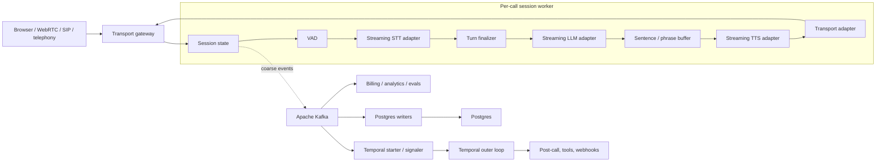

# VoiceMesh

VoiceMesh is a production-inspired reliability lab for real-time voice AI
infrastructure. This project is inspired by real-time voice infrastructure challenges
and public role requirements. It does **not** claim to reproduce or describe Vapi's
internal architecture.

The project provides a real local vertical slice: browser PCM input, VAD, OpenAI STT,
streaming OpenAI LLM output, OpenAI TTS, browser playback, Apache Kafka, Temporal OSS,
Postgres, OpenTelemetry, Jaeger, Prometheus, and Grafana.

## What It Demonstrates

- Real `VAD → STT → LLM → TTS → Transport` execution
- In-memory bounded queues with cork/uncork backpressure
- Provider adapters that isolate the session runtime from concrete APIs
- Kafka event streaming, replay, and duplicate-delivery experiments
- Temporal worker recovery for durable outer-loop work
- Postgres idempotency and transactional outbox mechanics
- OpenTelemetry traces and Prometheus metrics
- Provider latency/failure and database-outage injection
- A Next.js dashboard with browser microphone and PCM playback

## Architecture

The production-oriented design keeps the live media path in one per-call session
worker. Kafka, Postgres, and Temporal are adjacent systems, not handoff stages between
STT, LLM, and TTS.



The session worker owns the transport connection, active provider streams, call and
turn IDs, bounded token/audio queues, phrase buffering, cancellation, and barge-in
state. Kafka provides coarse durable events and fanout. Postgres is the system of
record. Temporal is optional for post-call and retry-heavy workflows; it is not part of
normal streaming or cork/uncork.

Read [docs/architecture.md](docs/architecture.md) for the full model and
[docs/runtime_boundaries.md](docs/runtime_boundaries.md) for turn fencing, cancellation,
and barge-in.

## Current POC

The working implementation intentionally has several simpler boundaries:

- Browser WebSocket is the demo transport adapter.
- VAD is RMS energy over real microphone PCM.
- STT buffers a completed turn, creates WAV, and calls OpenAI transcription.
- LLM and TTS stream through real bounded in-memory queues.
- Token and audio-chunk metadata is published to Kafka for lab visibility.
- The session runtime currently awaits Kafka and Postgres operations.
- A Temporal workflow starts per call and currently receives cork/uncork signals.
- Full-duplex barge-in, response fencing, and provider cancellation are not implemented.

These are documented current behaviors, not the recommended production architecture.
The target is streaming STT, coarse asynchronous events, asynchronous persistence, and
Temporal only in the durable outer loop.

## Kafka, Postgres, And Temporal

Kafka is for fanout, replay, persistence consumers, billing, analytics, debug timelines,
and triggering durable work. It should not carry every audio frame, STT partial, LLM
token, or TTS chunk by default.

Postgres stores tenant and assistant configuration, call metadata, final transcripts,
summaries, tool/webhook state, billing records, idempotency keys, and outbox rows. It
should not block the transition from STT to LLM or LLM to TTS.

Temporal is justified for post-call finalization, webhook retries, billing
finalization, summary/evaluation pipelines, recording/transcript finalization, and
long-running or state-changing tools. A one-step idempotent Kafka consumer may be
simpler when durable workflow semantics are unnecessary.

See [docs/kafka_vs_temporal.md](docs/kafka_vs_temporal.md),
[docs/events.md](docs/events.md), and
[docs/postgres_reliability.md](docs/postgres_reliability.md).

## Provider Adapters

The target contracts are `STTProvider`, `LLMProvider`, `TTSProvider`,
`TransportProvider`, and optionally `ToolExecutor`. Adapters normalize stream
lifecycle, partial/final transcripts, token deltas, tool calls, latency milestones,
cancellation, errors, and provider metadata.

OpenAI is the implemented default. The registry fails fast without
`OPENAI_API_KEY`; there is no silent fake-provider fallback. See
[docs/provider_abstractions.md](docs/provider_abstractions.md).

## Quick Start

Requirements:

- Docker Desktop with Compose v2
- Python 3.11+ for local tests and scripts
- Node.js 20+ for local dashboard development
- A real OpenAI API key

```bash
cp .env.example .env
# Edit .env and set OPENAI_API_KEY.
make up
```

Open:

- Dashboard: [http://localhost:3000/demo](http://localhost:3000/demo)
- FastAPI: [http://localhost:8000/docs](http://localhost:8000/docs)
- Temporal UI: [http://localhost:8080](http://localhost:8080)
- Kafka UI: [http://localhost:8081](http://localhost:8081)
- Jaeger: [http://localhost:16686](http://localhost:16686)
- Grafana: [http://localhost:3001](http://localhost:3001), `admin/admin`

## Browser Call

1. Run `make up`.
2. Open `http://localhost:3000/demo`.
3. Select **Start microphone** and allow microphone access.
4. Speak, then pause for roughly 700 ms.
5. Watch the current buffered STT turn finalize, LLM tokens stream, TTS audio arrive,
   and the browser play 24 kHz PCM.
6. Search the call trace in Jaeger under `voicemesh-api`.

The browser sends signed 16-bit PCM chunks. VAD measures real sample amplitude rather
than using a timer. WebRTC VAD or Silero is the production migration path.

## Reliability Demos

```bash
make demo-normal-call
make demo-tts-backpressure
make demo-duplicate-events
make demo-db-down
make demo-kill-worker
```

### TTS Backpressure

`make demo-tts-backpressure` requires no microphone. It creates spoken test input with
OpenAI, sends it through the normal WebSocket path, and injects 400 ms delay per TTS
output chunk. The bounded token queue reaches its high watermark and corks. After the
delay is removed, the queue drains to its low watermark and uncorks.

This proves in-memory backpressure. Kafka records the transitions for demo visibility;
Temporal is not architecturally required for them.

### Duplicate Event Replay

`make demo-duplicate-events` replays a persisted event with its original idempotency
key. Postgres uniqueness prevents a second persisted state transition and VoiceMesh
publishes `duplicate_event.ignored`.

### Postgres Down

`make demo-db-down` pauses Postgres for 15 seconds. Kafka and much of the in-memory path
remain available, while bounded DB retries and failures are visible. Current writes
that exhaust retries are not reconstructed automatically. The production direction is
Kafka-backed asynchronous persistence and reconciliation.

### Temporal Worker Crash

`make demo-kill-worker` stops and restarts only the Temporal worker. Workflow history
survives in Temporal server storage and pending work resumes. This demonstrates durable
outer-loop recovery, not recovery of an active browser or provider media stream.

## Commands

| Command | Purpose |
|---|---|
| `make up` | Build and start the complete local stack |
| `make down` | Stop the stack |
| `make restart` | Restart services |
| `make logs` | Follow service logs |
| `make api` | Run FastAPI locally |
| `make worker` | Run the Temporal worker locally |
| `make dashboard` | Run Next.js locally |
| `make migrate` | Reapply the idempotent SQL migration |
| `make create-topics` | Create required Kafka topics |
| `make smoke-live-pipeline` | Run a real OpenAI STT → LLM → TTS WebSocket smoke test |
| `make test` | Run Python tests |
| `make lint` | Run Ruff, mypy, and dashboard lint |

The smoke test synthesizes spoken input, sends real PCM through the WebSocket contract,
and verifies the persisted call outcome. It uses real OpenAI APIs and incurs normal API
usage.

## Event Contract

The current POC event model contains `event_id`, `call_id`, `turn_id`, `event_type`,
`stage`, timestamp, sequence number, idempotency key, payload, and optional trace ID.

The production contract should add:

```json
{
  "event_id": "uuid",
  "event_type": "string",
  "event_version": 1,
  "tenant_id": "string",
  "assistant_id": "string",
  "call_id": "string",
  "turn_id": "string | null",
  "response_id": "string | null",
  "sequence": 1,
  "timestamp": "iso8601",
  "trace_id": "string | null",
  "traceparent": "string | null",
  "idempotency_key": "string",
  "payload": {}
}
```

VoiceMesh uses Pydantic validation today. A production deployment should add a schema
registry and compatibility checks. Topics currently include `call-events`,
`pipeline-events`, `provider-events`, `outbox-events`, and `dead-letter-events`.

## Observability

The local stack instruments FastAPI, WebSocket operations, VAD, providers, queues,
Kafka, Postgres, and Temporal activities. Production tracing should propagate W3C
context through Kafka and workflow boundaries and add webhook/tool spans.

The primary latency SLI is end-of-speech to first audible agent audio. Component metrics
should include STT final latency, LLM time to first token, TTS time to first audio byte,
transport lag, queue depth, cork duration, barge-in cancellation latency, stale chunks,
provider errors, Kafka lag, Postgres pool wait, and webhook retries.

See [docs/otel_tracing.md](docs/otel_tracing.md).

## Documentation

- [Architecture](docs/architecture.md)
- [Runtime boundaries](docs/runtime_boundaries.md)
- [Event contracts](docs/events.md)
- [Kafka versus Temporal](docs/kafka_vs_temporal.md)
- [Provider adapters](docs/provider_abstractions.md)
- [Postgres reliability](docs/postgres_reliability.md)
- [OpenTelemetry](docs/otel_tracing.md)
- [Multi-tenant scaling and webhooks](docs/scaling.md)
- [Failure modes](docs/failure_modes.md)
- [Three-minute demo](docs/demo_script.md)

## Known Limitations

- STT is buffered per completed turn rather than continuously streamed.
- RMS VAD is environment-sensitive and lacks production endpointing calibration.
- Browser capture uses `ScriptProcessorNode`; an AudioWorklet is the migration path.
- Barge-in, response fencing, playback cancellation, and stale-chunk drops are absent.
- Only OpenAI provider adapters are implemented.
- Kafka publication and Postgres writes currently occur synchronously in `emit()`.
- Fine-grained token/chunk events are over-published for lab visibility.
- Critical events currently use direct Kafka publication plus outbox insertion, which
  can create duplicate Kafka deliveries.
- Temporal currently tracks routine call and backpressure state more closely than the
  recommended durable outer-loop model.
- Failed non-critical writes are visible but are not automatically reconciled.
- Docker Compose, Jaeger, Prometheus, and Grafana are local examples, not a production
  deployment, retention plan, or multi-region design.

## Future Work

- Streaming STT with normalized partial/final events
- Turn/response fencing, barge-in, and cooperative provider cancellation
- Media gateway plus WebRTC/SIP/telephony transport adapters
- Asynchronous Kafka-to-Postgres persistence and one authoritative outbox boundary
- Coarse event defaults with diagnostic sampling
- Tenant configuration cache, quotas, and load-aware call placement
- Customer tool/webhook delivery state and durable retry workflows
- Local Whisper, Ollama, and Piper adapters
- Kafka lag, Postgres pool-wait, and end-of-speech-to-first-audio metrics
