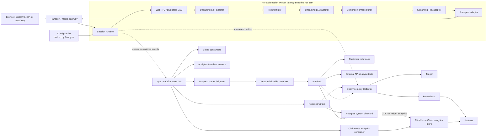
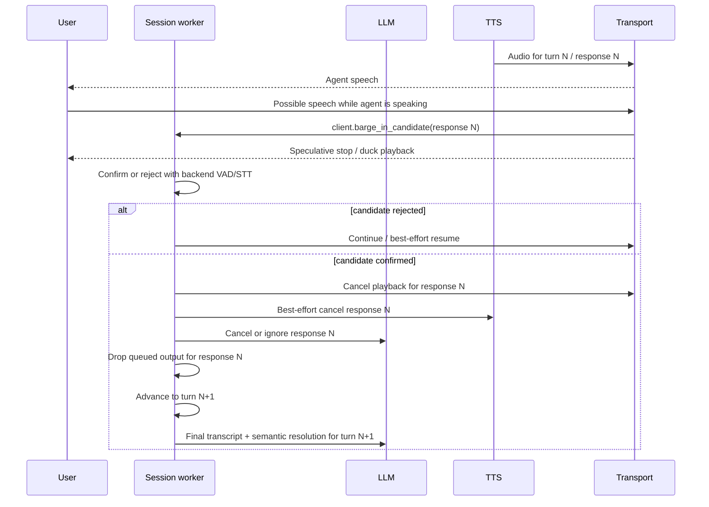
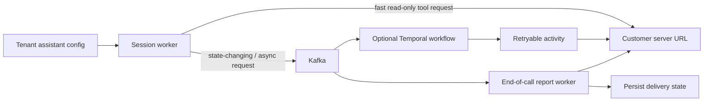
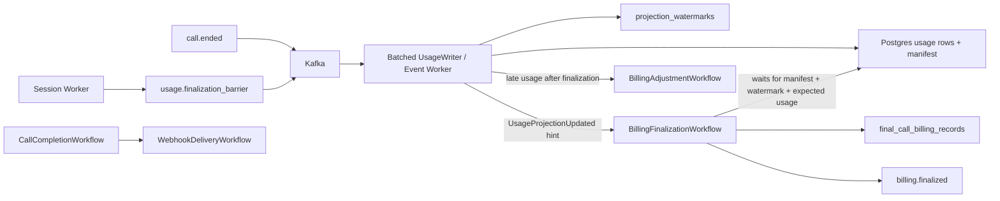

# Architecture

VoiceMesh is a production-inspired reliability lab for real-time voice infrastructure.
It explores public real-time voice platform problems without claiming to describe any
company's internal architecture.

The central design rule is that the live media path and the durable control plane have
different latency and consistency requirements. The session worker handles the live
turn in memory. Kafka, Postgres, ClickHouse, and Temporal sit beside that path; none is
the normal handoff mechanism between STT, LLM, and TTS.

## Target Architecture

## Runtime Ownership

One session worker owns one active call. It owns:

- the transport connection and media formats;
- `tenant_id`, `assistant_id`, `call_id`, current `turn_id`, and active `response_id`;
- VAD provider state, endpointing state, and noise-turn guardrails;
- active STT, LLM, and TTS streams;
- weighted, response-fenced text and audio queues;
- phrase buffering and playback progress;
- barge-in, cancellation, and stale-response fencing; and
- transient latency, queue-depth, and backpressure state.

This state is intentionally local to the worker handling the call. Moving each live
handoff through Kafka, Temporal, or Postgres would add network hops, serialization,
consumer scheduling, and failure modes directly to mouth-to-ear latency.

The production-oriented hot path is:

`Transport Gateway → Session Worker → VAD → streaming STT → streaming LLM → sentence/phrase buffer → streaming TTS → Transport`

The session worker passes a finalized user turn directly to the LLM while publishing a
coarse `stt.final_transcript` event asynchronously. The LLM stream feeds a bounded,
turn-scoped phrase buffer whose primary pressure signal is estimated queued
speak-ahead duration. TTS audio feeds a bounded, turn-scoped transport queue whose
primary pressure signal is queued playable audio duration.

See [runtime_boundaries.md](runtime_boundaries.md) for ownership, cancellation, and
barge-in semantics.

## Control And Durable Planes

### Kafka

Kafka is the durable event backbone for fanout, replay, persistence consumers, billing,
analytics, evaluation, debug timelines, and workflow triggers. It carries
coarse-grained facts such as call boundaries, finalized turns, response milestones,
provider errors, tool requests, webhook requests, and usage records.

Kafka is not the normal carrier for every 20 ms audio frame, STT partial, LLM token, or
TTS audio chunk. High-rate debug events should be sampled, aggregated, or enabled only
for a bounded diagnostic session.

### Postgres

Postgres is the durable system of record and query store. It holds tenant and assistant
configuration, provider and tool configuration, call metadata, final transcripts,
summaries, tool and webhook state, billing records, idempotency keys, and transactional
outbox rows.

Assistant configuration should be loaded at call start through a cache backed by
Postgres. The live path should not wait for a Postgres write before invoking the next
provider stage. Final transcripts, lifecycle events, and metrics should normally be
persisted by asynchronous consumers or outbox workers.

### ClickHouse Cloud

ClickHouse Cloud is the historical analytics projection for coarse events and
billing-facing analytical tables. It is useful for cross-call questions such as
provider latency trends, calls affected by corking, barge-in outcomes, noise-like turns
ignored, tenant usage, billing ledger analysis, and reliability comparisons over time.

ClickHouse does not replace Postgres, Prometheus, or Jaeger:

- Postgres remains the transactional system of record and billing ledger.
- Prometheus remains the live operational metrics and alerting store.
- Jaeger remains the detailed trace view for one call or workflow.
- ClickHouse stores delayed, replayable analytics rows derived from Kafka.

The analytics consumer has its own Kafka consumer group and commits offsets only after
ClickHouse acknowledges a batch insert. If ClickHouse is unavailable, the consumer
retries and dashboards become stale; active calls continue normally. See
[clickhouse-cloud.md](clickhouse-cloud.md).

For billing analytics, Postgres remains the source of truth and CDC can replicate
committed ledger rows, manifests, expectations, adjustments, and pricing dimensions into
ClickHouse. This complements Kafka event analytics rather than replacing the
transactional ledger.

### Temporal

Temporal is the durable outer loop for work that benefits from persisted workflow
state, timers, retries, and recovery after worker loss. VoiceMesh uses Temporal for:

- post-call completion and finalization;
- end-of-call webhook delivery retries;
- billing finalization;
- summary and evaluation generation;
- recording and transcript finalization;
- asynchronous or state-changing tool workflows; and
- long-running customer or external actions.

Temporal is not necessary to maintain an active media stream, and it should not receive
normal token, audio, turn, cork, or uncork traffic. Temporal owns durable business
processes; the session worker owns the active conversation.

See [temporal-workflows.md](temporal-workflows.md) for the workflow catalog.

## Backpressure

Backpressure is an in-memory session-worker concern first. Each cross-stage queue is
bounded, weighted, and has high and low watermarks:

1. A downstream queue reaches the weighted high watermark.
2. The session runtime marks that queue corked and pauses the producing coroutine at a
   safe boundary.
3. Non-critical partial/debug updates may be coalesced.
4. Finalized transcript and response events are retained for durable publication.
5. The downstream consumer drains the queue.
6. At the low watermark, the session runtime uncorks production.

`llm_to_tts` uses `queued_speak_ahead_ms`, estimated from text length and the configured
speech characters-per-second budget. `tts_to_transport` uses `queued_audio_ms`,
estimated from queued PCM duration. Item counts, character counts, and bytes are still
useful debug metrics, but they are not the primary production corking signal.

High/low hysteresis prevents flapping. A separate hard limit protects freshness: if too
much future speech or playable audio accumulates, the session worker cancels or flushes
the active response according to policy instead of silently buffering stale output.

Important or prolonged degradation may emit `pipeline.corked` and
`pipeline.uncorked` to Kafka for visibility. Hard limits may emit
`pipeline.hard_limit_reached`. Kafka, Postgres, Prometheus, Grafana, Jaeger, and
Temporal do not participate in the decision; routine transitions do not enter Temporal
workflow history.

Durable finalized events should not be lost once committed, but live token and audio
buffers are bounded, turn-scoped, and cancellable. They may be discarded on barge-in,
explicit cancellation, or stale-response detection. In real-time voice, fresh output
for the current turn is more valuable than completing an obsolete response.

## Turn Fencing And Barge-In

Every live item should carry enough identity to reject stale work:

- `tenant_id`
- `assistant_id`
- `call_id`
- `turn_id`
- `response_id` where applicable
- monotonic `sequence`
- `event_id`
- `trace_id`

Cancellation is cooperative where provider APIs support it and defensive everywhere
else. Browser detection is speculative; backend confirmation is authoritative. Before
sending a token or audio chunk, the worker verifies that its `turn_id` and `response_id`
still match the active generation. Late provider output is counted and dropped rather
than played.

## Provider Adapters

The stream module depends on normalized `STTProvider`, `LLMProvider`, `TTSProvider`,
`TransportProvider`, and optionally `ToolExecutor` contracts. Deepgram, OpenAI,
Cartesia, local Whisper, Ollama, Piper, SIP, and WebRTC are implementations behind
those contracts, not branches embedded in the session loop.

Adapters normalize stream lifecycle, partial/final transcripts, token deltas, tool
calls, first-token and first-audio-byte timing, cancellation, timeout/error categories,
media formats, and provider metadata. See
[provider_abstractions.md](provider_abstractions.md).

## Customer Webhooks And Tools

A customer-configured server URL is an external integration point, not a substitute for
internal Kafka or Temporal:

Fast, bounded, read-only tool calls may execute directly from the session worker with
strict deadlines and cancellation. State-changing, long-running, or retry-heavy tools
should leave the hot path and use a durable workflow or idempotent worker. End-of-call
reports should always be asynchronous and retryable, with delivery state in Postgres.

The implementation now has three explicit tool execution modes:

- `SYNC_DIRECT`: direct, short-lived API calls from the session worker/tool executor.
- `ASYNC_JOB`: accepted/pending work represented by Kafka events.
- `DURABLE_ACTION`: `DurableActionWorkflow` for long-running, cancelable, state-changing
  tools.

Temporal also owns the durable billing and delivery outer loop:

## Current Implementation Versus Production Direction

| Area | Current POC | Production direction |
|---|---|---|
| Transport | Browser WebSocket carrying PCM | Media gateway with WebRTC, SIP, or telephony adapters routing calls to session workers |
| VAD | WebRTC VAD over normalized PCM, smoothed endpointing, adaptive energy fallback, and STT guardrails for weak turns | Tune WebRTC mode/endpointing per environment, add provider-native endpointing and optional neural VAD such as Silero |
| STT | Long-lived OpenAI Realtime transcription session receives resampled 24 kHz PCM, emits partial deltas, and is manually committed at the VAD turn boundary | Add provider cancellation, item-order reconciliation, domain evaluation, and fallback routing |
| LLM | OpenAI streaming text deltas | Streaming adapter with response IDs, cancellation, tool-call normalization, and provider routing |
| TTS | Phrase-triggered OpenAI PCM stream | Streaming adapter with cancellable response IDs and playback acknowledgements |
| Barge-in | Browser speculative candidates, backend VAD confirmation, response fencing, stale audio rejection, and rule-based semantic resolution | Transport-native candidate signals, sample-accurate resume, neural/noise-aware intent policy, and provider-native abort |
| Backpressure | Weighted `llm_to_tts` speak-ahead and `tts_to_transport` audio-duration queues with response fences, stale drops, hard limits, and cork/uncork callbacks | Tune budgets from measured speech/playback rates and route severe degradation to SLO escalation |
| Kafka | Publishes coarse lifecycle, stage, provider, usage, and backpressure events; no raw frames, LLM tokens, or TTS chunks | Add schema registry, W3C headers, lag SLOs, and bounded asynchronous publication |
| Postgres | Dedicated Kafka event worker projects calls, events, metrics, usage, billing, and idempotency outside the provider chain | Separate ingestion/query pools, reconciliation tooling, and tenant-aware retention |
| Outbox | Billing events created from a DB usage projection are written atomically to the outbox and published once by the worker | Scale publishers with leases, stronger delivery metrics, and explicit event ownership |
| Temporal | Durable action, billing finalization, webhook delivery, and call completion workflows; routine cork/uncork stays in memory | Run Temporal Cloud or a hardened Temporal cluster for durable workflows while keeping hot-path provider/tool decisions inside session workers |
| Billing | Versioned price catalog, immutable usage records, per-call rollup, and dashboard; TTS token units are estimated | Provider invoice reconciliation, contract rates, taxes/credits, and tenant wallets |
| Identity | `call_id`, `turn_id`, sequence, event ID, trace ID | Add tenant, assistant, response, schema version, and propagated trace context |
| Deployment | Single-host Docker Compose | Replicated services, call-aware routing, autoscaling, quotas, and failure-domain isolation |

These differences are architectural debt and learning surfaces, not hidden production
claims. The working POC proves the vertical path and reliability mechanisms locally;
the target model describes how to preserve latency and correctness at larger scale.

## Scaling Model

Calls are routed to session workers, with each active call pinned to one worker for the
life of its transport session. Kafka topics should partition primarily by `call_id` to
preserve per-call ordering. `tenant_id` remains first-class metadata for quotas,
billing, access control, and observability.

Production scaling also requires per-tenant concurrency limits, provider quota
allocation, noisy-neighbor controls, admission control, load-aware routing, and stronger
enterprise isolation. See [scaling.md](scaling.md).

## Observability

Tracing follows asynchronous boundaries using W3C context in transport metadata and
Kafka headers. Spans cover the session worker, provider adapters, Kafka producers and
consumers, Postgres writers, Temporal workflows/activities, and webhook delivery.

The primary user-facing latency measure is end-of-speech to first agent audio. Component
metrics include STT final latency, LLM time to first token, TTS time to first audio byte,
transport send lag, queued speak-ahead milliseconds, queued audio milliseconds, cork
duration, cancellation latency, stale chunks dropped, provider errors, Kafka lag,
Postgres pool wait, and webhook retries.

See [otel_tracing.md](otel_tracing.md).
