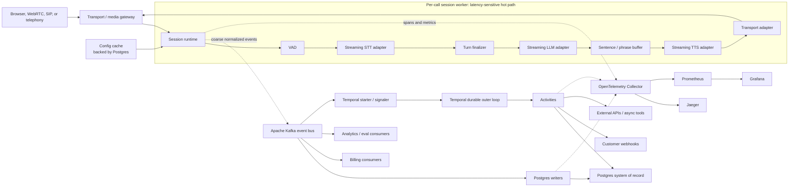
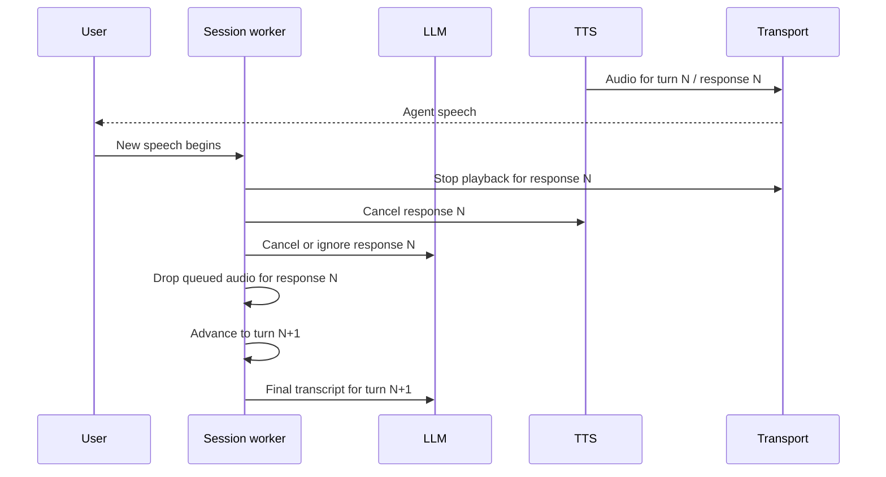
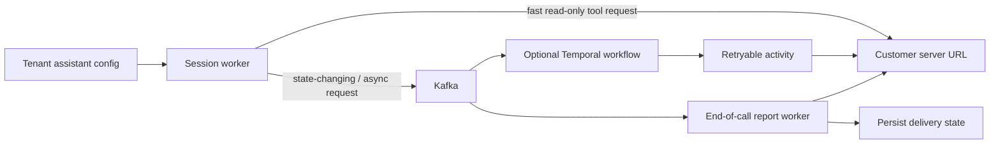

# Architecture

VoiceMesh is a production-inspired reliability lab for real-time voice infrastructure.
It is informed by public voice-platform problems, but it does not claim to describe
Vapi's internal architecture.

The central design rule is that the live media path and the durable control plane have
different latency and consistency requirements. The session worker handles the live
turn in memory. Kafka, Postgres, and Temporal sit beside that path; none is the normal
handoff mechanism between STT, LLM, and TTS.

## Target Architecture

## Runtime Ownership

One session worker owns one active call. It owns:

- the transport connection and media formats;
- `tenant_id`, `assistant_id`, `call_id`, current `turn_id`, and active `response_id`;
- VAD and turn-detection state;
- active STT, LLM, and TTS streams;
- bounded token and audio queues;
- phrase buffering and playback progress;
- barge-in, cancellation, and stale-response fencing; and
- transient latency, queue-depth, and backpressure state.

This state is intentionally local to the worker handling the call. Moving each live
handoff through Kafka, Temporal, or Postgres would add network hops, serialization,
consumer scheduling, and failure modes directly to mouth-to-ear latency.

The production-oriented hot path is:

`Transport Gateway → Session Worker → VAD → streaming STT → streaming LLM → sentence/phrase buffer → streaming TTS → Transport`

The session worker passes a finalized user turn directly to the LLM while publishing a
coarse `stt.final_transcript` event asynchronously. The LLM stream feeds a bounded,
turn-scoped phrase buffer. TTS audio feeds a bounded, turn-scoped transport queue.

See [runtime_boundaries.md](runtime_boundaries.md) for ownership, cancellation, and
barge-in semantics.

## Control And Durable Planes

### Kafka

Kafka is the durable event backbone for fanout, replay, persistence consumers, billing,
analytics, evaluation, debug timelines, and workflow triggers. It carries
coarse-grained facts such as call boundaries, finalized turns, response milestones,
provider errors, tool requests, webhook requests, and usage records.

Kafka is not the normal carrier for every 20 ms audio frame, STT partial, LLM token, or
TTS audio chunk. High-rate debug events should be sampled, aggregated, or enabled only
for a bounded diagnostic session.

### Postgres

Postgres is the durable system of record and query store. It holds tenant and assistant
configuration, provider and tool configuration, call metadata, final transcripts,
summaries, tool and webhook state, billing records, idempotency keys, and transactional
outbox rows.

Assistant configuration should be loaded at call start through a cache backed by
Postgres. The live path should not wait for a Postgres write before invoking the next
provider stage. Final transcripts, lifecycle events, and metrics should normally be
persisted by asynchronous consumers or outbox workers.

### Temporal

Temporal is an optional durable outer loop for work that benefits from persisted
workflow state, timers, retries, and recovery after worker loss. Good uses include:

- post-call completion and finalization;
- end-of-call webhook delivery retries;
- billing finalization;
- summary and evaluation generation;
- recording and transcript finalization;
- asynchronous or state-changing tool workflows; and
- long-running customer or external actions.

Temporal is not necessary to maintain an active media stream, and it should not receive
normal token, audio, turn, cork, or uncork traffic. A simpler deployment may use Kafka
plus idempotent workers for basic post-call jobs. Temporal is justified when the
business process needs durable timers, multi-step state, compensation, or retry
semantics that would otherwise be rebuilt in application code.

See [kafka_vs_temporal.md](kafka_vs_temporal.md) for the decision boundary.

## Backpressure

Backpressure is an in-memory session-worker concern first. Each cross-stage queue is
bounded and has high and low watermarks:

1. A downstream queue reaches the high watermark.
2. The session runtime marks that queue corked and pauses the producing coroutine at a
   safe boundary.
3. Non-critical partial/debug updates may be coalesced.
4. Finalized transcript and response events are retained for durable publication.
5. The downstream consumer drains the queue.
6. At the low watermark, the session runtime uncorks production.

Important or prolonged degradation may emit `pipeline.corked` and
`pipeline.uncorked` to Kafka for visibility. Routine transitions do not need to enter
Temporal workflow history.

Durable finalized events should not be lost once committed, but live token and audio
buffers are bounded, turn-scoped, and cancellable. They may be discarded on barge-in,
explicit cancellation, or stale-response detection. In real-time voice, fresh output
for the current turn is more valuable than completing an obsolete response.

## Turn Fencing And Barge-In

Every live item should carry enough identity to reject stale work:

- `tenant_id`
- `assistant_id`
- `call_id`
- `turn_id`
- `response_id` where applicable
- monotonic `sequence`
- `event_id`
- `trace_id`

Cancellation is cooperative where provider APIs support it and defensive everywhere
else. Before sending a token or audio chunk, the worker verifies that its `turn_id` and
`response_id` still match the active generation. Late provider output is counted and
dropped rather than played.

## Provider Adapters

The stream module depends on normalized `STTProvider`, `LLMProvider`, `TTSProvider`,
`TransportProvider`, and optionally `ToolExecutor` contracts. Deepgram, OpenAI,
Cartesia, local Whisper, Ollama, Piper, SIP, and WebRTC are implementations behind
those contracts, not branches embedded in the session loop.

Adapters normalize stream lifecycle, partial/final transcripts, token deltas, tool
calls, first-token and first-audio-byte timing, cancellation, timeout/error categories,
media formats, and provider metadata. See
[provider_abstractions.md](provider_abstractions.md).

## Customer Webhooks And Tools

A customer-configured server URL is an external integration point, not a substitute for
internal Kafka or Temporal:

Fast, bounded, read-only tool calls may execute directly from the session worker with
strict deadlines and cancellation. State-changing, long-running, or retry-heavy tools
should leave the hot path and use a durable workflow or idempotent worker. End-of-call
reports should always be asynchronous and retryable, with delivery state in Postgres.

## Current Implementation Versus Production Direction

| Area | Current POC | Production direction |
|---|---|---|
| Transport | Browser WebSocket carrying PCM | Media gateway with WebRTC, SIP, or telephony adapters routing calls to session workers |
| VAD | RMS energy over real PCM | WebRTC VAD, Silero, or provider-native endpointing with calibrated interruption handling |
| STT | Buffers one speech turn, creates WAV, then calls OpenAI transcription | Long-lived streaming STT connection receiving frames continuously and emitting partial/final transcripts |
| LLM | OpenAI streaming text deltas | Streaming adapter with response IDs, cancellation, tool-call normalization, and provider routing |
| TTS | Phrase-triggered OpenAI PCM stream | Streaming adapter with cancellable response IDs and playback acknowledgements |
| Backpressure | Real bounded token/audio queues and cork/uncork callbacks | Turn-scoped queues, explicit cancellation, partial coalescing, stale-item drops, and SLO-based escalation |
| Kafka | Publishes each LLM token and TTS chunk metadata for lab visibility | Coarse events by default; sampled or temporary fine-grained debug streams |
| Postgres | `emit()` awaits event persistence and state updates | Async Kafka consumers/outbox workers; no synchronous DB dependency between live stages |
| Outbox | Critical events are both directly published and inserted into outbox | One authoritative publication path per logical event with explicit deduplication |
| Temporal | Workflow starts per call and receives cork/uncork/provider signals | Durable outer-loop workflows only for lifecycle actions and retry-heavy side effects |
| Identity | `call_id`, `turn_id`, sequence, event ID, trace ID | Add tenant, assistant, response, schema version, and propagated trace context |
| Deployment | Single-host Docker Compose | Replicated services, call-aware routing, autoscaling, quotas, and failure-domain isolation |

These differences are architectural debt and learning surfaces, not hidden production
claims. The working POC proves the vertical path and reliability mechanisms locally;
the target model describes how to preserve latency and correctness at larger scale.

## Scaling Model

Calls are routed to session workers, with each active call pinned to one worker for the
life of its transport session. Kafka topics should partition primarily by `call_id` to
preserve per-call ordering. `tenant_id` remains first-class metadata for quotas,
billing, access control, and observability.

Production scaling also requires per-tenant concurrency limits, provider quota
allocation, noisy-neighbor controls, admission control, load-aware routing, and stronger
enterprise isolation. See [scaling.md](scaling.md).

## Observability

Tracing follows asynchronous boundaries using W3C context in transport metadata and
Kafka headers. Spans cover the session worker, provider adapters, Kafka producers and
consumers, Postgres writers, Temporal workflows/activities, and webhook delivery.

The primary user-facing latency measure is end-of-speech to first agent audio. Component
metrics include STT final latency, LLM time to first token, TTS time to first audio byte,
transport send lag, queue depths, cork duration, cancellation latency, stale chunks
dropped, provider errors, Kafka lag, Postgres pool wait, and webhook retries.

See [otel_tracing.md](otel_tracing.md).
