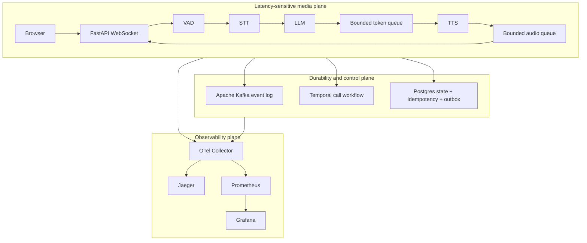

# Architecture

VoiceMesh separates the latency-sensitive media path from durable coordination.

## Media Plane

The browser converts microphone samples to signed 16-bit PCM and sends binary
WebSocket frames. The server computes RMS energy for each chunk and tracks speech plus
silence. After speech has been followed by the configured silence window, the turn is
closed and wrapped in a standard WAV container.

STT runs once for the finalized turn. LLM generation streams tokens into a bounded
queue while a concurrent consumer groups text into speakable phrases. TTS streams
24 kHz PCM chunks into another bounded queue, and a transport task sends them to the
browser. The browser schedules each chunk on an `AudioContext` timeline.

## Backpressure

Each cross-stage queue has a high and low watermark. Crossing the high watermark:

1. marks the call corked,
2. publishes `pipeline.corked`,
3. persists the state,
4. signals the Temporal workflow,
5. updates WebSocket dashboard state, and
6. naturally blocks upstream `put` operations when the bounded queue fills.

The queue never discards final transcripts, final responses, or token data. Once the
depth reaches the low watermark, the pipeline publishes `pipeline.uncorked` and resumes
normal flow.

## Event and State Planes

Kafka is the replayable event stream. Postgres is the query and idempotency store.
Temporal is the durable lifecycle state machine. They intentionally overlap in
visibility but not in responsibility.

Critical events write an idempotency key, event row, and outbox row atomically.
The outbox publisher sends unpublished rows to Kafka and marks them published. Events
that are naturally emitted from the live pipeline are also sent directly to Kafka so
the stream remains available during non-critical Postgres degradation.

## Failure Boundaries

- Provider calls have explicit stage timeouts.
- DB writes use a bounded three-attempt exponential retry.
- Kafka uses idempotent producer mode and all-replica acknowledgement.
- Temporal server state is independent of worker process lifetime.
- WebSocket disconnect ends the call but does not erase already durable events.

## Scaling Direction

The POC is single-node Compose. A production evolution would partition calls by
`call_id`, run stateless API replicas, use a replicated Kafka cluster, isolate Temporal
and application Postgres databases, and add load-aware provider routing. The provider
and event boundaries are intentionally shaped to permit that evolution.

