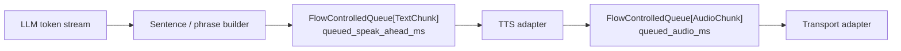
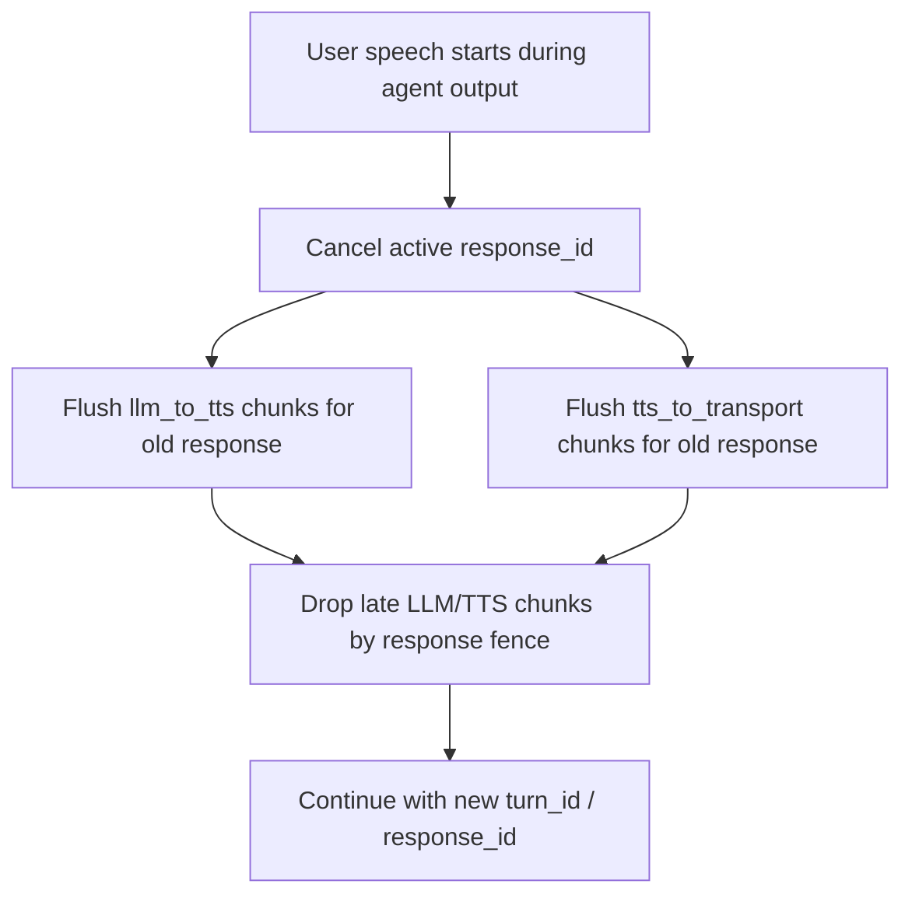

# Backpressure And Corking

VoiceMesh corking is an in-memory hot-path flow-control mechanism. It protects the
active call from accumulating stale future speech when one stage outruns the next.
Kafka, Postgres, Temporal, Prometheus, Grafana, Jaeger, and future ClickHouse analytics
observe the result; they do not decide whether a live queue is corked.



## Weighted Queues

The hot path uses `FlowControlledQueue` instead of raw `asyncio.Queue` depth as the
primary control signal.

`llm_to_tts` tracks `queued_speak_ahead_ms`. Each queued text chunk estimates future
speech duration from text length and `SPEECH_CHARS_PER_SECOND`.

`tts_to_transport` tracks `queued_audio_ms`. Each queued audio chunk estimates playable
PCM duration from sample rate and byte length.

Both queues still expose item count for debugging, but item count is not the production
corking signal. `"Sure."` and a long sentence are not equal from a speech-latency point
of view.

## Hysteresis

Each queue has low, high, and hard-limit watermarks:

```text
depth >= high watermark -> cork upstream producers
depth <= low watermark  -> uncork upstream producers
depth >= hard limit     -> cancel/flush according to policy
```

High/low hysteresis prevents flapping when depth hovers near a threshold. Producers call
`wait_if_corked()` before enqueueing more text/audio, so they pause before the queue is
completely full. Queue capacity remains a safety net.

Default lab settings:

```text
llm_to_tts:
  low  = 300 ms speak-ahead
  high = 1200 ms speak-ahead
  hard = 2500 ms speak-ahead

tts_to_transport:
  low  = 300 ms queued audio
  high = 1200 ms queued audio
  hard = 2500 ms queued audio
```

## Turn And Response Fencing

Queued items are typed envelopes:

```text
TextChunk(call_id, turn_id, response_id, sequence, text, estimated_speech_ms)
AudioChunk(call_id, turn_id, response_id, sequence, data, sample_rate, duration_ms)
EndOfStream(call_id, turn_id, response_id, reason)
```

Before TTS consumes text or transport sends audio, the session worker verifies that the
item still belongs to the active `turn_id` and `response_id`. Late provider output from
an older response is dropped and counted instead of being spoken.

## Cancellation And Barge-In

Corking means a downstream stage is slow. Barge-in means the old response is invalid.
VoiceMesh treats them separately.



The current server-side runtime implements response fencing, queue flushing, stale
chunk drops, and cancellation-state release for waiting producers. Full browser
stop-playback semantics and provider-native request cancellation are still production
hardening work.

## Observability

Prometheus metrics use stable labels only:

- `voicemesh_queue_depth{stage, depth_unit}`
- `voicemesh_queue_items{stage}`
- `voicemesh_backpressure_transitions_total{stage, transition, reason_code, depth_unit}`
- `voicemesh_backpressure_duration_seconds{stage}`
- `voicemesh_backpressure_hard_limit_total{stage, depth_unit, policy}`
- `voicemesh_stale_chunks_dropped_total{stage, chunk_type, reason_code}`
- `voicemesh_stale_audio_dropped_ms_total{stage, reason_code}`

Do not use `call_id`, `turn_id`, `response_id`, or free-form reasons as Prometheus
labels. Those high-cardinality identifiers belong in traces, logs, Kafka events, and
Postgres rows.

Kafka receives coarse observability events such as `pipeline.corked`,
`pipeline.uncorked`, `pipeline.hard_limit_reached`, `pipeline.response_cancelled`, and
`pipeline.stale_chunk_dropped`. Temporal is not signaled for routine cork/uncork.
