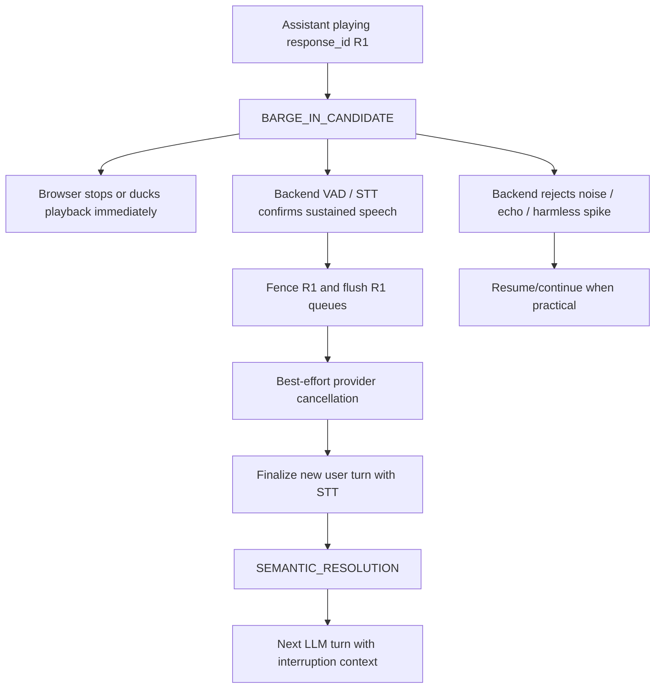

# Barge-In Handling

VoiceMesh treats barge-in as a hot-path media problem first and a semantic problem
second. Kafka, Temporal, Postgres, Prometheus, Grafana, Jaeger, and future ClickHouse
analytics observe outcomes; they do not decide whether live playback should stop.



## Candidate, Confirmation, Resolution

The browser WebSocket transport provides fast speculative interruption. When microphone
energy rises while assistant audio is playing, the demo page stops scheduled playback
locally and sends `client.barge_in_candidate` with the active `turn_id`,
`response_id`, last played sequence, and approximate played audio milliseconds.

The browser signal is not authoritative. The backend session worker confirms or rejects
the candidate using its existing VAD/endpointing evidence:

- sustained speech duration;
- speech-frame ratio;
- backend VAD state transition to speaking;
- eventually, final STT transcript quality.

Only confirmed barge-in fences the active response, flushes matching text/audio queue
items, and starts best-effort provider cancellation. One browser energy spike can stop
playback speculatively, but it does not permanently cancel the backend response by
itself.

## Response Fencing

Every live output item is fenced by:

```text
call_id
turn_id
response_id
sequence
```

This applies to LLM tokens, phrase-buffered text, TTS audio chunks, transport messages,
and cancellation messages. The backend rejects late chunks whose `turn_id` or
`response_id` is stale. The browser also keeps a cancelled-response set and refuses to
play audio chunks for cancelled responses.

Provider cancellation is best-effort. The local response fence is mandatory and is the
thing that prevents late provider output from reaching playback.

## What The Caller Heard

Generated text is not the same as spoken text. The browser reports playback progress
through `playback.progress`, and interruption candidates include a playback cursor:

```json
{
  "type": "playback.progress",
  "turn_id": "turn_7",
  "response_id": "resp_42",
  "last_played_sequence": 17,
  "played_audio_ms": 1240
}
```

The session worker keeps an approximate interrupted assistant memory:

```json
{
  "role": "assistant",
  "status": "interrupted",
  "generated_text": "Full generated answer...",
  "content": "Only the prefix likely heard...",
  "played_audio_ms": 1240
}
```

The next LLM turn receives only the likely spoken prefix as shared conversational
context. The unspoken suffix is retained for debugging metadata, not treated as heard
conversation.

## Semantic Resolution

After STT finalizes the user’s interrupted turn, VoiceMesh classifies the transcript as:

- `CORRECTION`
- `CANCELLATION_REQUEST`
- `ADDITIVE_CONTEXT`
- `BACKCHANNEL`
- `CLARIFICATION_OR_REPEAT`
- `NOISE_OR_ECHO`
- `UNKNOWN_INTERRUPTION`

The first implementation is deterministic and rule-based. It is intentionally easy to
inspect and replace later with a lightweight classifier.

Media cancellation and business-action cancellation are deliberately separate. If the
user says “cancel that,” the barge-in coordinator only stops/fences assistant speech.
The LLM/tool routing layer must decide whether “that” refers to speech, conversation
intent, or a durable external action such as a refund workflow.

## Browser POC Limitations

The browser implementation is intentionally a local demo transport adapter:

- microphone energy is only a speculative candidate signal;
- exact playback resume after a rejected candidate is best-effort, not sample-perfect;
- browser echo/noise rejection depends on browser audio constraints and backend VAD;
- provider-native cancellation is currently represented as local fencing plus
  best-effort adapter hooks;
- semantic classification is rule-based and not tuned per assistant.

Production transports such as SIP/WebRTC media gateways would provide their own
candidate signals and playback acknowledgements, but the session-worker state machine
and response fencing model remain the same.
