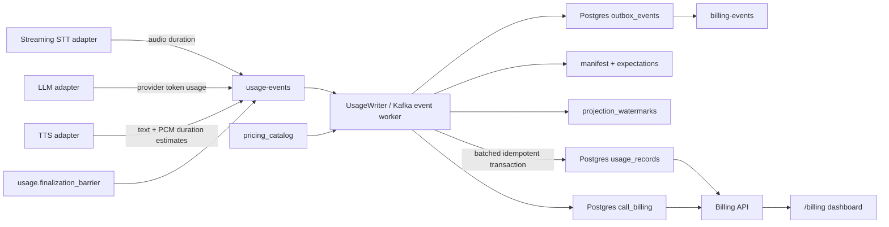

# Billing Pipeline

VoiceMesh includes a local, event-driven billing ledger for the deployed voice agent.
It demonstrates cost attribution and idempotent financial projection; it is not a
provider invoice or a complete payments system.

## Data Flow

The session worker emits usage measurements to Kafka. It does not calculate or write
the durable bill. At call end it emits `usage.finalization_barrier`, also keyed by
`call_id` on `usage-events`, so the barrier is ordered behind prior usage events for the
same call. The event worker consumes in bounded batches, inserts idempotency keys and
usage rows, applies the price catalog, updates rollups, stores the manifest/expectations,
and advances projection watermarks in one database transaction.

## Metered Units

| Stage | Current unit | Source | Accuracy |
|---|---|---|---|
| STT | audio minute | PCM samples accepted by the STT stream | measured |
| LLM | input, cached input, and output tokens | OpenAI Responses API usage | provider reported |
| TTS | input text and output audio tokens | text length and PCM duration | estimated |
| Platform | call minute | measured call duration | measured |

The final call amount is:

`provider_cost_usd + platform_fee_usd`

`BILLING_PLATFORM_RATE_PER_MINUTE_USD` controls the platform fee. The seeded price
catalog uses the version `openai-2026-06-15`, while
`BILLING_PRICING_VERSION` identifies the complete lab pricing policy used by a call.

## Postgres Tables

- `pricing_catalog`: versioned unit prices by provider, model, and usage type.
- `usage_records`: immutable priced measurements, unique by source event and usage type.
- `call_usage_manifests`: finalization barrier metadata and expected turns.
- `call_usage_expectations`: expected per-turn usage facts used by billing readiness.
- `projection_watermarks`: last projected Kafka offset by consumer group/topic/partition.
- `call_billing`: per-call duration, provider cost, platform fee, total, and status.
- `final_call_billing_records`: finalized invoice-like snapshot for a call.
- `billing_adjustments`: immutable late-usage adjustments after finalization.
- `outbox_events`: billing notifications waiting for Kafka publication.

The dashboard reads:

- `GET /billing/summary`
- `GET /billing/calls`
- `GET /billing/calls/{call_id}`

## Idempotency And Recovery

Kafka delivery is at least once. The projector inserts the source `idempotency_key`
before applying usage. Duplicate events stop inside the same transaction, so they
cannot create a second usage row or inflate the bill.

If Postgres is unavailable, the consumer does not commit the failed Kafka offset. After
bounded retries it recreates the consumer and replays the event when the database
returns. If Kafka publication of the DB-derived billing event fails, its outbox row
remains unpublished and is retried.

Batching is bounded by count and time. Locally the defaults are
`KAFKA_CONSUMER_BATCH_SIZE=100` and `KAFKA_CONSUMER_BATCH_TIMEOUT_MS=500`, and a
`usage.finalization_barrier` forces the current batch to be projected promptly. Billing
may start before usage is visible in Postgres, but Temporal waits for the manifest,
projection watermark, and per-turn expectations before finalization.

## Local Pricing Caveats

The migration contains a dated pricing snapshot for demonstration. Provider pricing,
enterprise discounts, regional pricing, taxes, credits, failed-request policy, and
invoice rounding can change independently. A production billing system should:

- ingest contract-aware prices without rewriting historical rows;
- reconcile usage against provider invoices;
- support credits, taxes, wallets, and adjustments;
- retain the raw provider usage/request identifiers;
- use decimal rounding rules defined per currency; and
- audit every ledger mutation.

TTS rows are visibly marked `estimated=true`. They must not be presented as exact
provider charges until the adapter receives provider-reported usage or reconciliation
data.
