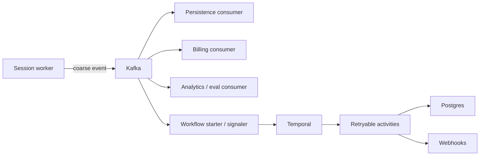

# Kafka Versus Temporal

Kafka and Temporal are both durable, but they solve different problems. Neither belongs
between STT, LLM, and TTS in the live media path.

## Kafka: Durable Event Backbone

Kafka records coarse-grained facts and distributes them to independent consumers. It is
appropriate for:

- fanout and replay;
- asynchronous Postgres persistence;
- billing and usage aggregation;
- analytics, evaluation, and debug timelines;
- provider health processing;
- webhook and tool-request dispatch; and
- starting or signaling a durable workflow when a lifecycle action is required.

Partition by `call_id` to preserve per-call order. Consumers must be idempotent because
delivery is at least once.

Kafka should not carry every audio frame, STT partial, LLM token, or TTS chunk by
default. The current POC emits token and chunk metadata for demo visibility; production
should sample or aggregate that traffic.

## Temporal: Durable Outer Loop

Temporal is useful for processes that need durable state, timers, retries, multi-step
coordination, or recovery after worker loss:

- post-call completion;
- webhook delivery retries;
- billing finalization;
- summary and evaluation generation;
- recording and transcript finalization;
- asynchronous or state-changing tool execution; and
- long-running customer actions.

Temporal is not necessary for the active voice loop. Normal VAD, STT, LLM, TTS,
transport, token buffering, audio buffering, and cork/uncork decisions remain inside
the session worker.

## Decision Rule

Use Kafka when the requirement is "record this fact and let multiple consumers react."
Use Temporal when the requirement is "ensure this stateful process eventually reaches a
business outcome across retries, waits, and worker restarts."

A one-step idempotent consumer often does not need Temporal. A multi-step customer
workflow with hours of retry and compensation often does. Do not force a workflow
engine into the design merely because it is available.

## Correct Interaction

Examples:

- `stt.final_transcript` goes to Kafka for persistence and analytics. It does not need a
  Temporal signal.
- A prolonged provider failure may produce `call.failed`; a consumer may start
  post-call finalization in Temporal.
- `webhook.delivery_requested` may start a Temporal workflow if delivery requires a
  durable retry schedule.
- Routine `pipeline.corked` and `pipeline.uncorked` are handled in memory. Severe
  pressure may be emitted to Kafka for observability without entering workflow history.

## Current POC

The current `CallWorkflow` starts at call admission and receives routine backpressure
and provider-failure signals. That implementation demonstrates Temporal durability and
worker restart, but it is intentionally broader than the recommended production role.

The production direction is to remove routine cork/uncork transitions from Temporal,
keep provider failover decisions local when they must happen within a live latency
budget, and use Temporal only when an outer-loop lifecycle action must survive process
loss.
