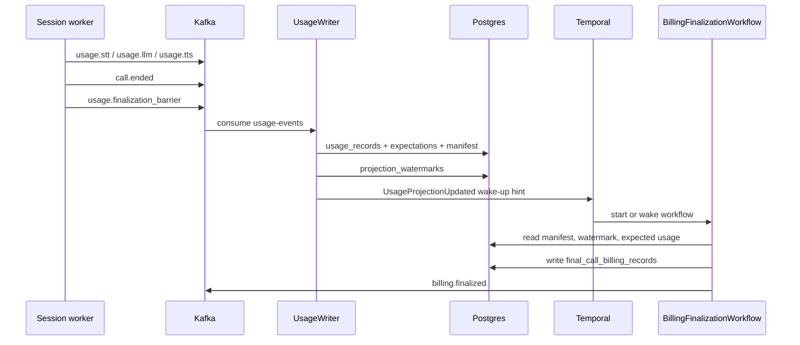

# Temporal Workflows

VoiceMesh uses Temporal for durable business workflows. It is not in the
live media path:

```text
Transport -> Session Worker -> VAD -> STT -> LLM -> TTS -> Transport
```

The session worker still owns active provider streams, text/audio queues,
backpressure, cancellation, and eventual barge-in behavior. Temporal owns durable work
that can outlive the call or needs retry/audit semantics:

```text
Durable tool actions
Post-call billing finalization
Webhook delivery retries
Call completion state
Workflow completion events
```

## Workflows

### `DurableActionWorkflow`

- starts state-changing external actions;
- accepts cancellation before or after the external request ID exists;
- calls create/cancel/status APIs from activities;
- persists tool state in Postgres;
- emits tool events through the outbox/Kafka path.

### `BillingFinalizationWorkflow`

- starts after `call.ended`;
- treats Postgres usage rows, manifests, and watermarks as the source of truth;
- waits for the call usage manifest;
- waits for the Kafka projection watermark to catch up to the manifest offset;
- waits for every expected `turn_id + usage_type` row;
- finalizes into `final_call_billing_records`;
- emits `billing.finalized`.

### `WebhookDeliveryWorkflow`

- posts an event payload to a customer URL;
- uses idempotency headers;
- records every attempt;
- retries with backoff;
- marks `DELIVERED` or `FAILED`.

### `CallCompletionWorkflow`

- coordinates post-call summary, billing finalization, final call state, and
  `workflow.done`.

### `BillingAdjustmentWorkflow`

- starts when usage arrives after final billing has already been created;
- recomputes from immutable `usage_records`;
- writes an immutable `billing_adjustments` row;
- emits `billing.adjustment_created`;
- never mutates the original finalized ledger.

## Billing Finalization Flow

Live metering remains outside Temporal. The session worker emits coarse usage events to
Kafka during the call, then emits `usage.finalization_barrier` on `usage-events` at call
end. The event worker acts as the `UsageWriter`: it writes usage, the call usage
manifest, per-turn expectations, and projection watermarks to Postgres idempotently.



`call.ended` starts the workflow, but it is not treated as proof that all usage has
reached Postgres. The workflow waits until:

- the `call_usage_manifests` row exists;
- the `projection_watermarks` row has caught up to the manifest's Kafka
  topic/partition/offset;
- every expected `turn_id + usage_type` row has matching normalized usage in Postgres.

`UsageProjectionUpdated` signals are wake-up hints after successful DB writes. Postgres
is the source of truth. Duplicate Kafka events are protected by idempotency keys and
unique usage rows, and duplicate Temporal signals are safe.

The billing workflow states are:

```text
WAITING_FOR_CALL_END
WAITING_FOR_MANIFEST
WAITING_FOR_PROJECTION
WAITING_FOR_USAGE
FINALIZING
FINALIZED
FINALIZED_WITH_WARNINGS
FAILED
NEEDS_REVIEW
```

## Production Notes

Temporal workflow IDs should be deterministic by business entity, for example
`billing-finalization:{call_id}`, `call-completion:{call_id}`, or
`webhook-delivery:{delivery_id}`. Activities should use idempotency keys when touching
Postgres, external tools, provider APIs, or customer webhooks.

Kafka and CDC carry facts into query and analytics stores. Temporal coordinates the
durable process: waiting for usage readiness, retrying activities, applying timers,
recording audit history, and completing or escalating the workflow.
